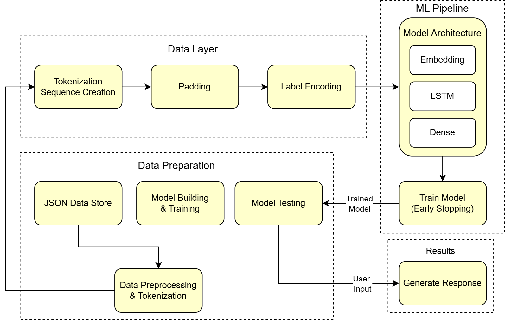

# CureConnect: Mental Health Chatbot

CureConnect is a mental health chatbot designed to provide support to users dealing with various mental health concerns. The chatbot leverages advanced machine learning to provide compassionate support and guidance for individuals seeking mental health assistance.

## Core Capabilities

- **Natural Dialogue System**: Experience fluid conversations through our advanced text interface that understands context and nuances in mental health discussions.
- **Adaptive Response System**: Our AI continuously refines its responses based on interaction context, ensuring relevant and empathetic support for each unique situation.
- **Wellness Resource Hub**: The chatbot provides users with curated mental health materials, including expert guidance, therapeutic techniques, and educational content.

## Architecture

## Technical Framework

- **Core Engine**: Python-based backend with advanced NLP capabilities
- **AI Framework**: Custom neural networks built with TensorFlow/Keras
- **Interface**: Streamlit-powered responsive web application
- **Data Management**: Structured JSON architecture with Pandas integration
- **Processing**: NumPy-accelerated computational operations

## Screenshots

## Feedback and Support:
We’re open to suggestions, feedback, and bug reports. For inquiries, please contact [piyushanurag12@gmail.com](mailto:piyushanurag12@gmail.com).
